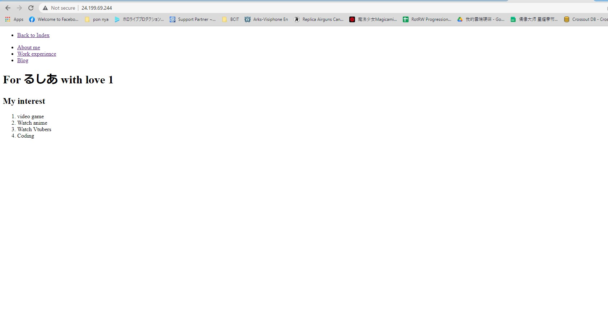
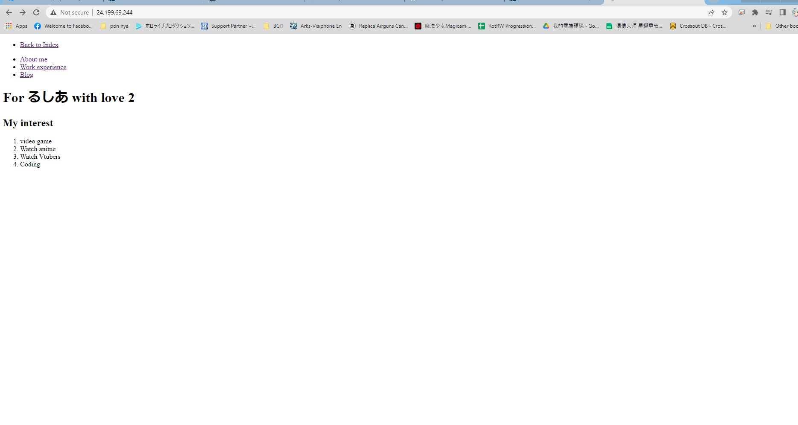
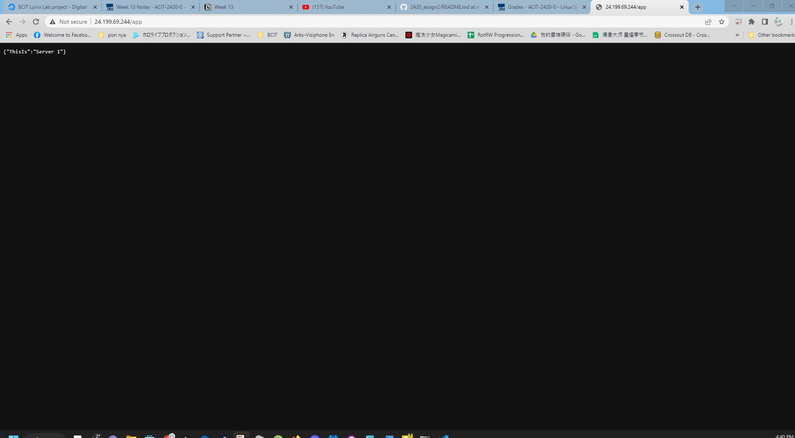
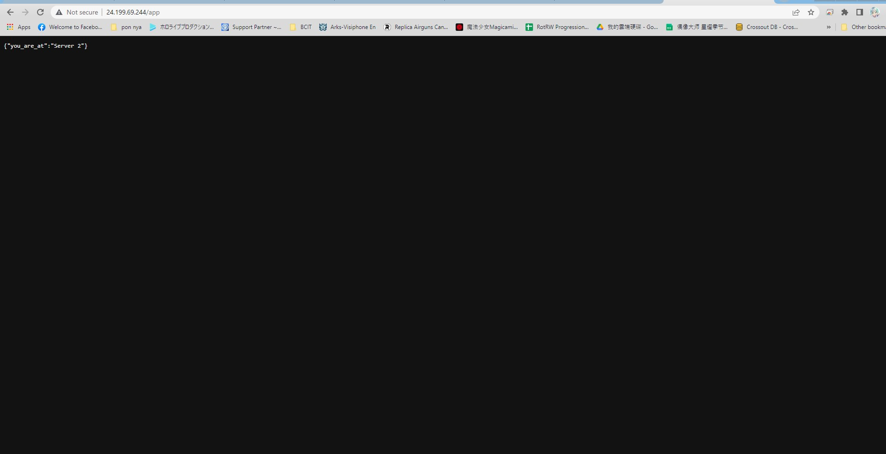

# 2024 Assignment 2
 This tutorial will walk you through the steps to set up a caddy sever with Digital Ocean services. The tutorial will also show you how to set up a domain name and how to use the caddy server to host a website.

pre-requisite: WSL, a ssh public key, Digital Ocean account

## Step 1: Create VPC network
1. go to your Digital Ocean main 1page and click on "Networking" on the left side bar 
2. click on "Create VPC" button
3. name your VPC network and select the region you want to create the network in

## Step 2: Create Droplet
1. click on "Create Droplet" button on the upper left right cornor of your project page
2. select the region you want to create the droplet in 
3. select the size of the droplet you want to create
4. select the image you want to use for the droplet
5. select the VPC network you want to use for the droplet
6. select the SSH key you want to use for the droplet
7. name your droplet
8. click on "Create Droplet" button
9. add tags for your droplet

## Step 3: Create Load Balancer
1. click on "Networking" on the left side bar 
2. click on "Load Balancers" next to "VPC"
3. click on "Create Load Balancer" button
4. select your VPC network
5. on "connect Droplets" section, select the tags you want to connect to the load balancer
6. for "Forwarding Rules" section, select "HTTP" and port 80 if its not already selected
7. name your load balancer
8. select your project
9. click on "Create Load Balancer" button

## Step 4 Set up firewall
1. click on "Networking" on the left side bar 
2. click on "Create Firewall" 
3. name your firewall
4. add HTTP TCP port 80 to the firewall
5. remove AllI IPV4 and IPV6 from the HTTP rule and select your VPC network instead
6. select the droplets you want to add to the firewall
7. click on "Create Firewall" button

## Step 5: ssh into your droplet (this is for all droplets that is created for web server)
1. in your terminal type `ssh root@your droplet ip address`
2. type `yes` if you get a warning message
3. set up a regular user account for your droplet
4. create a password for user
5. disable root login using `sudo nano /etc/ssh/sshd_config` and change `PermitRootLogin yes` to `PermitRootLogin no`
6. save and exit the file
7. restart ssh service using `sudo systemctl restart sshd`

## Step 6: install caddy server
1. ssh into your droplet
2. update your package list using `sudo apt update`
3. install caddy server using the following command:
``` 
sudo apt install -y debian-keyring debian-archive-keyring apt-transport-https

curl -1sLf 'https://dl.cloudsmith.io/public/caddy/stable/gpg.key' | sudo gpg --dearmor -o /usr share/keyrings/

caddy-stable-archive-keyring.gpg

curl -1sLf 'https://dl.cloudsmith.io/public/caddy/stable/debian.deb.txt' | sudo tee /etc/apt/sources.list.d/caddy-stable.list

sudo apt update

sudo apt install caddy 

```
(these steps are offical instructions from caddy website)
## Step 7: prepare webapp
1. ssh into your droplet the following codes are a sample webapp
2. put it in a directory you want to use for your webapp 
```
// Require the framework and instantiate it
const fastify = require('fastify')({ logger: true })

// Declare a route
fastify.get('/app', async (request, reply) => {
  return { hello: 'Server 1' }
})

// Run the server!
const start = async () => {
  try {
    await fastify.listen({ port: 65535, host: '127.0.0.1' })
  } catch (err) {
    fastify.log.error(err)
    process.exit(1)
  }
}
start()
```

## Step 8: prepare static HTML page
1. ssh into your droplet   
the following codes are a sample static HTML page
2. put it in /var/www/html directory


## Step 9: configure caddy server
1. this is a sample for caddy server configuration file
```
http:// {
  root * /var/www/html
  reverse_proxy /app localhost:5050
  file_server
}
```

## step 10: set up crate app service
1. create a service file for your webapp
```
[Unit]
Description=Yay, a fastify webapp
After=network-online.target
Wants=network-online.target

[Service]
ExecStart=/home/star/.volta/bin/node /home/star/appify/index.js
User=star
Group=star
Restart=always
RestartSec=10
TimeoutStopSec=90
SyslogIdentifier=hello_web

[Install]
WantedBy=multi-user.target
```
## step 11 install node using volta
follow the instructions on the volta website to install node for both server 
1. `curl https://get.volta.sh | bash`
2. `source ~/.bashrc`
3. `volta install node`
4. `volta install npm`

## step 12 change permision for your caddy file
follow the instructions on the volta website to install node for both server 
1. `sudo chown caddy:caddy /etc/caddy/Caddyfile`
2. `sudo chmod 660 /etc/caddy/Caddyfile`

## step 13: start caddy server and your webapp service
follow the instructions on the volta website to install node for both server 
1. `sudo systemctl start caddy`
2. `sudo systemctl enable caddy`
3. `sudo systemctl start hello_web`
4. `sudo systemctl enable hello_web`

## step 14: test if your webapp and web server is working
1. use `curl 127.0.0.1` to test if your web server is working
2. use `curl 127.0.0.1:5050/app` to test if your webapp is working

## step 15: final check
1. In your browser, go to your load balancer ip address
2. you should see your static HTML page
3. if you go to your load balancer ip address/app you should see your webapp



